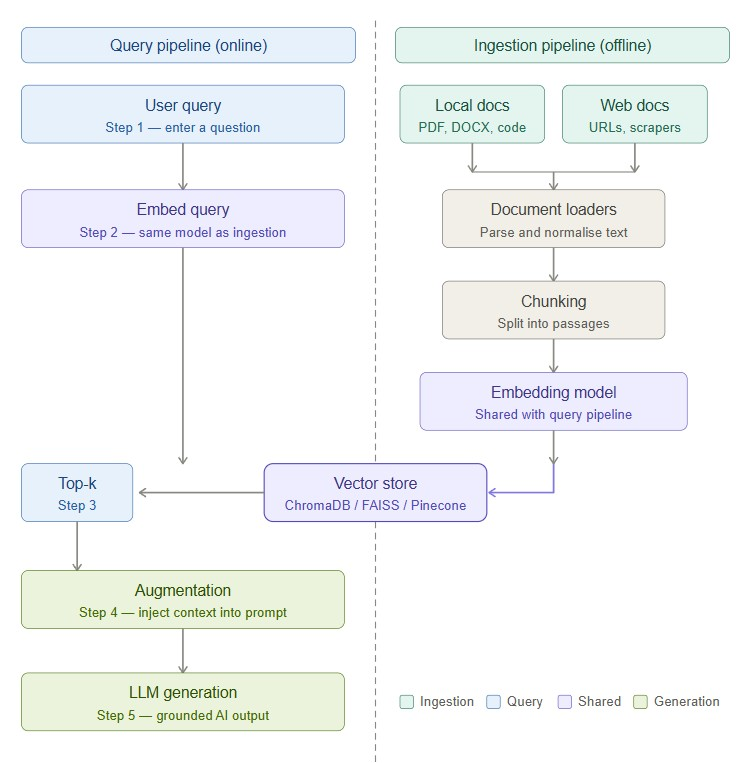
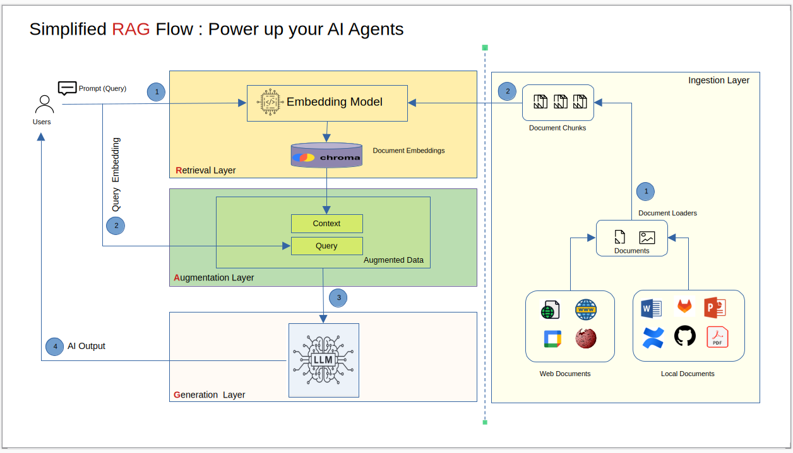

### RAG : RAG has two completely separate workflows that you need to understand:

𝗢𝗳𝗳𝗹𝗶𝗻𝗲 — the ingestion pipeline (runs once, or on schedule)
① Load your documents (PDFs, URLs, code repos, Word files)
② Split them into small, meaningful passages (chunking)
③ Convert each passage into a vector — a mathematical fingerprint — using an embedding model
④ Store all vectors in a vector database (ChromaDB, FAISS, Pinecone, etc.)

𝗢𝗻𝗹𝗶𝗻𝗲 — the query pipeline (runs every time a user asks something)
① Receive the user's question
② Embed the question using the exact same embedding model
③ Find the most relevant passages via similarity search (top-k retrieval)
④ Inject those passages into the LLM prompt as context
⑤ The LLM generates an answer grounded in YOUR data

### Desing Flow for Design Documente Creation

#
# Gmail Server MCP Server
#
send an email notification with folloing details: 
--recipient 'brijeshdhaker@gmail.com'
--subject 'AI Notification Test - 2026-04-17#{id}'
--body 'Hello {name},\n\n This is automated AI message send using AI Tools #Message-{id}'
--params {"id":"2001", "name":"Brijesh"}

#
# SQL Server MCP Server
#
fetch results for provided complex sql query with parameters :
--template select `NAME`, `AGE`, `ADDRESS`, CONVERT(SALARY, FLOAT) AS `SALARY` from CUSTOMERS WHERE ID = {id}
--params {"id":"1"}