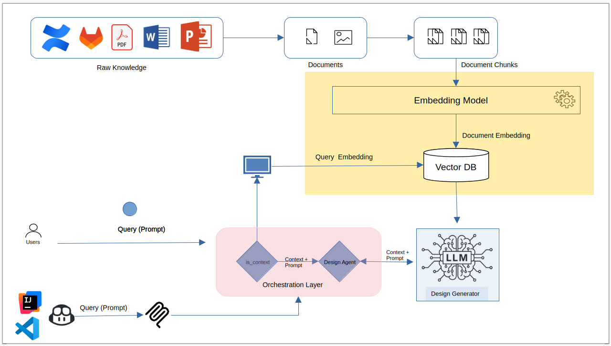

## Desing Flow for Design documente creation

#
#
#
send an email notification with folloing details: 
--recipient 'brijeshdhaker@gmail.com'
--subject 'AI Notification Test - 2026-04-17#{id}'
--body 'Hello {name},\n\n This is automated AI message send using AI Tools #Message-{id}'
--params {"id":"2001", "name":"Brijesh"}

#
# SQL Server MCP Server
#
fetch results for provided complex sql query with parameters :
--template select `NAME`, `AGE`, `ADDRESS`, CONVERT(SALARY, FLOAT) AS `SALARY` from CUSTOMERS WHERE ID = {id}
--params {"id":"1"}